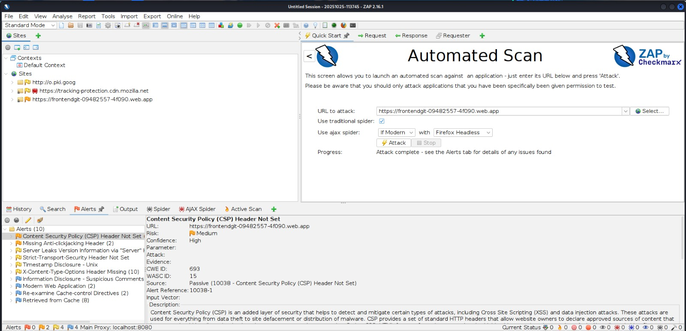
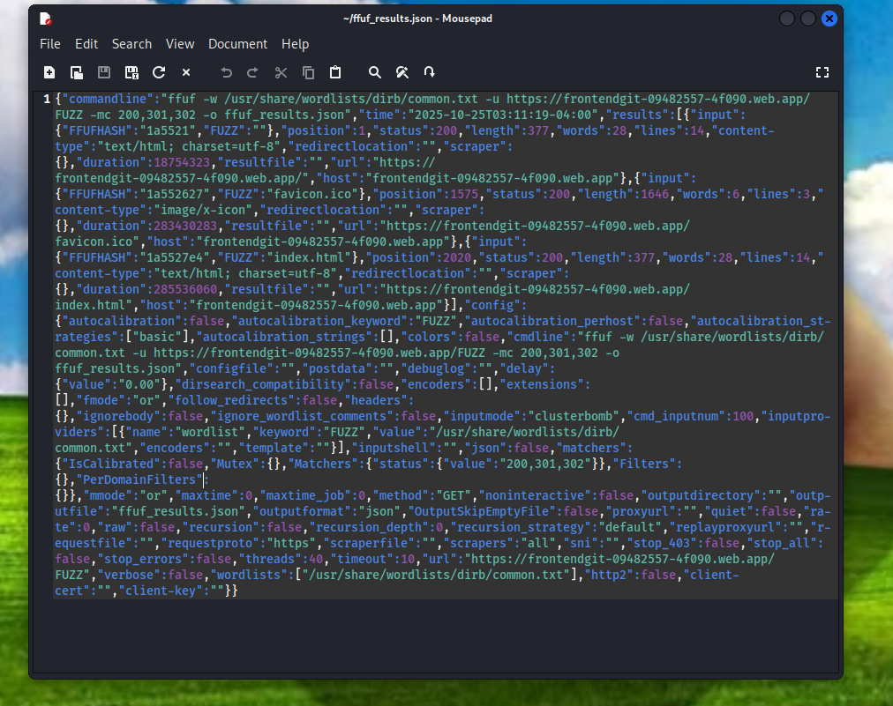
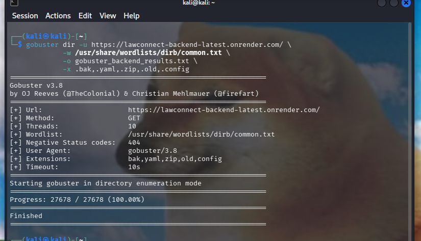
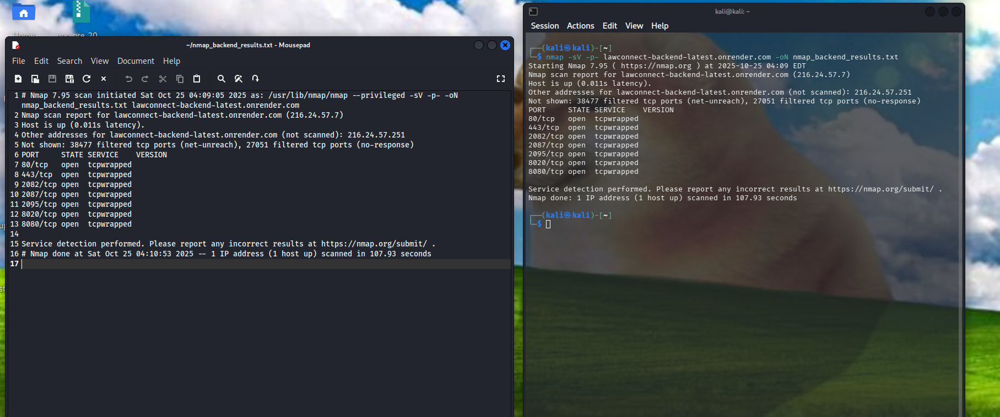

<p align="center">
  
</p>

<h3 align="center"> Universidad Peruana de Ciencias Aplicadas</h3>
<h3 align="center"> Ingeniería de Software  </h3>
<h3 align="center"> Informe de Trabajo Final – Anti-Hacking y Nuevas Tendencias de Seguridad</h3>
<h3 align="center"> NRC: 14423</h3>
<h3 align="center"> Docente: David Carlos Vera Olivera </h3>
<h3 align="center"> Nombre de la consultora: BlueLock Security</h3>

#### Integrantes
- Chero Eme, Eduardo Andre - u20201f282
- Estrada Cajamune, Abraham Andres - u202112164
- Pariona Lucas, José Manuel - u202119257
- Burga, Anaely - u202118264


<h4 align="center"> Octubre, 2025</h4>

___

# Registro de versiones del informe

| Versión | Fecha      | Autor             | Descripción de modificación                                                                           |
|---------|------------|-------------------|-------------------------------------------------------------------------------------------------------|
| 1.0     | 14/10/25   | Eduardo Chero     | Creación del archivo base en Markdown para el desarrollo del Final Project                            |
| 1.1     | 17/10/25   | Eduardo Chero     | Desarrollo del capitulo 1                           |
| 1.2     | 18/10/25   | Pariona Jose      | Documento Firmado y Aceptación del Servicio de Pentesting                    |

# Project Report Collaboration Insights


# Contenido

1.  [Student Outcome](#student-outcome)
2.  [Capítulo I: Introducción](#capítulo-i-introducción)
    1.  [1.1. Startup Profile (Cliente)](#11-startup-profile-cliente)
        -   [Descripción de la empresa PyME](#descripción-de-la-empresa-pyme)
        -   [Expectativas del cliente](#expectativas-del-cliente)
    2.  [1.2. Consultora de Ciberseguridad (Equipo)](#12-consultora-de-ciberseguridad-equipo)
        -   [Descripción de la consultora](#descripción-de-la-consultora)
        -   [Perfiles de los integrantes y roles Scrum](#perfiles-de-los-integrantes-y-roles-scrum)
    3.  [1.3. Solution Profile](#13-solution-profile)
        -   [Antecedentes y problemática](#antecedentes-y-problemática)
        -   [Objetivos del pentesting](#objetivos-del-pentesting)
    4.  [1.4. Aceptación del Servicio de Pentesting](#14-aceptación-del-servicio-de-pentesting)
3.  [Capítulo II: Metodología Ágil y de Pentesting](#capítulo-ii-metodología-ágil-y-de-pentesting)
    1.  [2.1. Marco de referencia](#21-marco-de-referencia)
    2.  [2.2. Backlog inicial](#22-backlog-inicial)
    3.  [2.3. Planificación de sprints (Sprint Planning)](#23-planificación-de-sprints-sprint-planning)
        -   [Sprint 1: Reconocimiento & Escaneo inicial](#sprint-1-reconocimiento--escaneo-inicial)
        -   [Sprint 2: Enumeración y vulnerabilidades preliminares](#sprint-2-enumeración-y-vulnerabilidades-preliminares)
        -   [Sprint 3: Explotación controlada (web, APIs)](#sprint-3-explotación-controlada-web-apis)
        -   [Sprint 4: Post-explotación y persistencia](#sprint-4-post-explotación-y-persistencia)
        -   [Sprint 5: Informe final y recomendaciones](#sprint-5-informe-final-y-recomendaciones)
    4.  [2.4. Definición de Done (DoD)](#24-definición-de-done-dod)
    5.  [2.5. Herramientas](#25-herramientas)
4.  [Capítulo III: Desarrollo del Proyecto por Sprints](#capítulo-iii-desarrollo-del-proyecto-por-sprints)
    1.  [Sprint 1 – Reconocimiento y Escaneo](#sprint-1--reconocimiento-y-escaneo)
    2.  [Sprint 2 – Enumeración y Vulnerabilidades](#sprint-2--enumeración-y-vulnerabilidades)
    3.  [Sprint 3 – Explotación](#sprint-3--explotación)
    4.  [Sprint 4 – Post-explotación y Persistencia](#sprint-4--post-explotación-y-persistencia)
    5.  [Sprint 5 – Informe Final y Recomendaciones](#sprint-5--informe-final-y-recomendaciones)
5.  [Capítulo IV: Resultados Consolidados](#capítulo-iv-resultados-consolidados)
    1.  [4.1. Matriz de vulnerabilidades](#41-matriz-de-vulnerabilidades)
    2.  [4.2. Evidencias técnicas](#42-evidencias-técnicas)
    3.  [4.3. Impacto en el negocio](#43-impacto-en-el-negocio)
6.  [Capítulo V: Recomendaciones y Plan de Mitigación](#capítulo-v-recomendaciones-y-plan-de-mitigación)
    1.  [5.1. Recomendaciones técnicas](#51-recomendaciones-técnicas)
    2.  [5.2. Recomendaciones organizacionales](#52-recomendaciones-organizacionales)
    3.  [5.3. Priorización por impacto/urgencia](#53-priorización-por-impactourgencia)
7.  [Capítulo VI: Conclusiones y Recomendaciones](#capítulo-vi-conclusiones-y-recomendaciones)
    -   [Conclusiones y recomendaciones del equipo](#conclusiones-y-recomendaciones-del-equipo)
    -   [Lecciones aprendidas en metodología ágil](#lecciones-aprendidas-en-metodología-ágil)
    -   [Relación con Student Outcome 2](#relación-con-student-outcome-2)
    -   [Video “About-the-Team”](#video-about-the-team)
8.  [Bibliografía](#bibliografía)


# Student Outcome
| Criterio específico | Acciones realizadas | Conclusiones |
|---|---|---|
|La capacidad de aplicar el diseño de ingeniería para producir soluciones que satisfagan necesidades específicas con consideración de salud pública, seguridad y bienestar, así como factores globales, culturales, sociales, ambientales y económicos.| **TP1** **PARIONA LUCAS JOSE MANUEL** <br> Se elaboró el Documento de Aceptación del Servicio de Pentesting, definiendo formalmente el alcance, restricciones y condiciones éticas para garantizar la seguridad y privacidad de los sistemas del cliente. <br> Se planificó el Sprint 1 (Reconocimiento y Escaneo inicial) aplicando principios de ingeniería segura y metodologías ágiles para estructurar un proceso controlado, reproducible y ético. <br> Se ejecutaron las actividades de reconocimiento, escaneo y documentación de resultados bajo criterios de mínima intrusión, respeto por los activos del cliente y cumplimiento de buenas prácticas internacionales de ciberseguridad. | **TP1** En la TP1: El proyecto demostró la aplicación efectiva del diseño de ingeniería orientado a la seguridad, permitiendo generar soluciones que protegen la integridad de la información y el bienestar digital del cliente. Las decisiones técnicas se tomaron considerando factores globales, sociales y económicos, promoviendo la cultura de seguridad responsable y el desarrollo sostenible de servicios tecnológicos confiables.|

# Capítulo I: Introducción
## 1.1. Startup Profile (Cliente)
### Descripción de la empresa PyME
Law Connect es un marketplace digital que sirve como nexo entre personas que requieren asesoría legal y abogados profesionales, facilitando un intercambio de servicios. La misión de la empresa es descentralizar el mercado legal en Perú y democratizar el acceso a abogados calificados, basándose en las valoraciones de los propios usuarios.


La plataforma utiliza herramientas tecnológicas como videollamadas, chat en vivo y la posibilidad de agendar reuniones presenciales, permitiéndole tener alcance nacional. Además, Law Connect busca ser una solución al desempleo en el sector legal, conectando abogados con clientes potenciales . Su objetivo principal es asegurar que todos tengan acceso a asesoría legal de calidad.

### Expectativas del cliente
**Confidencialidad e Integridad de Datos:** Asegurar que la información sensible de los clientes y de los abogados esté protegida contra accesos no autorizados.

**Disponibilidad del Servicio:** Garantizar que la plataforma (aplicación web, APIs, móviles)  se mantenga operativa y no sea susceptible a ataques de denegación de servicio.

**Gestión de Identidad:** Verificar la robustez de los módulos de autenticación, registro  y gestión de sesiones.

**Reporte de Vulnerabilidades:** Recibir un informe claro que identifique y priorice las vulnerabilidades encontradas para poder mitigarlas eficientemente

### Descripción de la consultora
BlueLock Security es una consultora de ciberseguridad formada por integrantes del curso enfocados en la investigación, detección y análisis de vulnerabilidades en aplicaciones y servicios de empresas que confian en nosotros para asegurarles que estos no tengan problemas ni generen riesgos de seguridad tanto para estas empresas como para los usuarios.

### Perfiles de los integrantes y roles Scrum
| Integrante                                                                                    | Rol            |     Código | Carrera                | Perfil                                                                                                                                                                                                                                                                                                                                                                                                                                                                                                                                                                                  |
| --------------------------------------------------------------------------------------------- | -------------- | ---------: | ---------------------- | --------------------------------------------------------------------------------------------------------------------------------------------------------------------------------------------------------------------------------------------------------------------------------------------------------------------------------------------------------------------------------------------------------------------------------------------------------------------------------------------------------------------------------------------------------------------------------------- |
| Estrada Cajamune, Abraham Andres <br>  | Scrum Master   | U202112164 | Ingeniería de Software | Estudiante de ingeniería de software en la Universidad Peruana de Ciencias Aplicadas. Con sólidos conocimientos para el desarrollo Web y Aplicaciones Moviles; tanto frontend como backend.                                                                                                                                                                                                                                                                                                                                                                                             |
| Pariona Lucas, José Manuel <br>        | Product Owner  | U202119257 | Ingeniería de Software | Tengo 20 años. En la actualidad estoy estudiando la carrera de Ingeniería de Software en la Universidad Peruana de Ciencias Aplicadas. Cuento con conocimientos intermedios y avanzados en algunos lenguajes de programación. HTML, CSS, JAVASCRIPT (Avanzado) C++, JAVA, PYTHON (Intermedio) Esto con respecto a la programación, además también de conocimientos con desarrollo web y desarrollo de apps. Me considero una persona responsable, que inspira confianza en el trabajo en grupo. Además, soy bastante adaptativo a la presión y los problemas que pueden llegar a pasar. |
| Chero Eme, Eduardo Andre <br>           | Pentester Lead | U20201F282 | Ingeniería de Software | Estudiante de insgenieria de software con conocimientos en ciberseguridad Experiencia en backend y frontend (Spring Boot, Angular).                                                                                                                                                                                                                                                                                                                                                                                                                                                     |
| Burga, Anaely  <br>                 | Pentester      | U20201F282 | Ingeniería de Software | Estudio Ingeniería en la UPC. Cuento con conocimientos intermedios en programación (Python, Java) y en desarrollo web (HTML, CSS, JavaScript)                                                                                                                                                                                                                                                                                                                                                                                                                                           |
## 1.3. Solution Profile
### Antecedentes y problemática
El cliente, Law Connect, opera un marketplace digital que maneja un alto volumen de información personal identificable (PII) y datos confidenciales relacionados con casos legales. La problemática de seguridad radica en que, al ser una plataforma que conecta múltiples usuarios (clientes y abogados) y que busca facilitar la búsqueda de asesoría, expone una superficie de ataque considerable.

Las principales preocupaciones de seguridad incluyen:

**Fuga de Datos:** El riesgo de exposición de datos personales de clientes y abogados, o detalles de casos legales confidenciales.

**Acceso No Autorizado:** La posibilidad de que un atacante suplante la identidad de un usuario o abogado, o escale privilegios dentro de la aplicación.

**Manipulación de Datos:** El riesgo de que se alteren las calificaciones de los abogados o los detalles de los contratos.

**Interrupción del Servicio:** Un ataque exitoso podría dejar la plataforma inoperativa, afectando el negocio principal de la startup.

### Objetivos del pentesting

**Objetivo General:** Evaluar el estado actual de la seguridad de los activos digitales de Law Connect (Aplicación Web, APIs) mediante la ejecución de pruebas de penetración controladas, siguiendo las fases de un hacking ético.

**Objetivos Específicos:**
- Identificar y explotar vulnerabilidades del OWASP Top 10 en la aplicación web.
- Evaluar la seguridad de los endpoints de las APIs utilizadas por la plataforma.
- Realizar escaneos de red y servidores para identificar servicios expuestos y vulnerabilidades conocidas.
- Priorizar los hallazgos utilizando el estándar CVSS.
- Elaborar un informe técnico y ejecutivo que incluya un plan de mitigación detallado. 

## 1.4. Aceptación del Servicio de Pentesting
**Documento de aceptacion del Servicio de Pentesting:**
<br>
https://docs.google.com/document/d/1y76aXW5gGyK-XvYmcVV_zBNBIXcbHb8tMVlu24L5oU0/edit?usp=sharing
<br>

<h3 align="center"> Alcance Autorizado</h3>


<h3 align="center"> Firmas</h3>


# Capítulo II: Metodología Ágil y de Pentesting
## 2.1. Marco de referencia
Para la ejecución de este proyecto de auditoría de seguridad para Law Connect, nuestro equipo ha adoptado un marco de trabajo ágil basado en Scrum con los estándares técnicos y las fases estructuradas de metodologías líderes en ciberseguridad.

**Scrum:** Utilizamos Scrum para gestionar el proyecto de pentesting como una serie de 5  sprints de corta duración. Cada Sprint se enfoca en un conjunto específico de objetivos de seguridad.

**PTES (Penetration Testing Execution Standard):** Las fases técnicas de nuestro trabajo siguen el estándar PTES, que divide el proceso en:

- Interacciones previas (Planificación)
- Recolección de Inteligencia (Reconocimiento)
- Modelado de Amenazas
- Análisis de Vulnerabilidades (Escaneo)
- Explotación
- Post-Explotación
- Reporte

**OWASP Top 10 (Open Worldwide Application Security Project):** Este recurso nos ayudara como una guia para reconocer las vulnerabilidades mas comunes dentro de una app web y sus servicios asi como sus posibles soluciones.

## 2.2. Backlog inicial

| ID     | Épica         | Historia de Usuario | Criterios de Aceptación |
|--------|---------------|---------------------|----------------------------------------|
| US-01  | Planificación | **Como** Product Owner, **quiero** definir y documentar el alcance autorizado (dominios, IPs) con "Law Connect", **para** asegurar que todas las pruebas se mantengan dentro de las Reglas de Compromiso. | **Given**: tenemos la reunión inicial con el cliente. **When**: se documentan los activos. **Then**: el cliente firma el documento de autorización. |
| US-02  | Reconocimiento | **Como** pentester externo, **quiero** recolectar información pública sobre "Law Connect", **para** identificar tecnologías, subdominios y empleados sin enviar tráfico directo. | **Given**: el nombre del dominio principal. **When**: utilizo técnicas de `Google Dorking`, `Shodan` y análisis de repositorios. **Then**: se genera un listado de subdominios, tecnologías y posibles correos de empleados. |
| US-03  | Escaneo       | **Como** pentester, **quiero** identificar todos los hosts vivos dentro del rango de IP autorizado, **para** mapear la infraestructura activa. | **Given**: el rango de IP del cliente. **When**: ejecuto un escaneo de descubrimiento `nmap -sn`. **Then**: se entrega una lista de IPs que respondieron al escaneo. |
| US-04  | Escaneo       | **Como** pentester, **quiero** escanear los puertos TCP/UDP abiertos en los hosts vivos, **para** enumerar los servicios y versiones expuestos. | **Given**: la lista de IPs activas. **When**: ejecuto un escaneo de puertos y servicios `nmap -sV -p-`. **Then**: se entrega un reporte detallando IP, Puerto, Servicio y Versión de cada servicio expuesto. |
| US-05  | Reconocimiento | **Como** pentester, **quiero** identificar los proveedores de servicios en la nube y posibles buckets de almacenamiento mal configurados, **para** buscar fugas de información. | **Given**: el dominio del cliente. **When**: utilizo herramientas de enumeración de cloud. **Then**: se documenta si existen buckets públicos o accesibles. |
| US-06  | Escaneo | **Como** pentester, **quiero** ejecutar un escaneo automatizado con `Nessus` contra los servicios expuestos **para** identificar rápidamente CVEs y fallos de configuración conocidos. | **Given**: los resultados del escaneo `Nmap` **When**: configuro y ejecuto un escaneo completo de `Nessus`, **Then**: se genera un reporte priorizado de vulnerabilidades de infraestructura |
| US-07  | Escaneo Web | **Como** pentester web, **quiero** realizar un escaneo automatizado con `OWASP ZAP` contra la aplicación web de "Law Connect", **para** identificar vulnerabilidades comunes del OWASP Top 10. | **Given**: la URL de la aplicación web. **When**: ejecuto el escáner activo de `ZAP`. **Then**: se genera un reporte inicial de hallazgos. |
| US-08  | Enumeración API | **Como** pentester de API, **quiero** enumerar todos los endpoints de la API REST de "Law Connect", **para** entender la superficie de ataque de la API. | **Given**: la URL base de la API. **When**: utilizo fuzzing de directorios y endpoints. **Then**: se entrega un listado de endpoints válidos y sus códigos de respuesta. |
| US-9  | Enumeración Web | **Como** pentester web, **quiero** mapear manualmente la aplicación web (login, perfiles, búsqueda de abogados, gestión de casos) usando Burp Suite, **para** entender el flujo de la aplicación. | **Given**: la URL de la aplicación y credenciales de prueba. **When**: navego por todas las funciones de cliente y abogado con el proxy interceptando. **Then**: se genera un Site Map en Burp Suite que identifica todas las funciones clave. |
| US-10  | Explotación Web | **Como** pentester, **quiero** explotar una vulnerabilidad de Inyección SQL en el "buscador de abogados", **para** obtener una Prueba de Concepto (PoC) de extracción de datos. | **Given**: un formulario de búsqueda sospechoso. **When**: ejecuto sqlmap para confirmar y explotar la inyección. **Then**: se obtiene una PoC. |
| US-11  | Explotación Web | **Como** pentester, **quiero** acceder a los casos legales del "Cliente X" manipulando los IDs en la URL (IDOR), **para** demostrar el control de acceso roto. | **Given**: estoy autenticado como "Cliente A" y conozco el ID de un caso del "Cliente X". **When**: intercepto la solicitud y la cambio por la del "Cliente X". **Then**: se obtiene una PoC mostrando el acceso exitoso a los datos ajenos. |
| US-12  | Explotación Web | **Como** pentester, **quiero** inyectar un script (XSS) en el perfil del abogado, **para** demostrar que puedo "robar" la cookie de sesión de un cliente que visite ese perfil. | **Given**: un campo vulnerable a XSS en el perfil. **When**: inyecto una carga útil de XSS. **Then**: el script se ejecuta exitosamente en el navegador de la víctima. |
| US-13  | Explotación Infra. | **Como** pentester, **quiero** explotar un servicio de red vulnerable en un servidor de "Law Connect", **para** obtener una shell inicial. | **Given**: una vulnerabilidad de infraestructura explotable, **When**: utilizo Metasploit para lanzar el exploit correspondiente. **Then**: se obtiene una captura de pantalla de la shell o sesión de Meterpreter. |


## 2.3. Planificación de sprints (Sprint Planning)

### Sprint 1: Reconocimiento & Escaneo inicial
<br>

**Objetivo del sprint (planificación):**
<br>
Realizar la recolección de inteligencia (reconocimiento) y el escaneo automático/semiautomático de los activos autorizados para mapear la superficie de ataque de Law Connect y generar artefactos reproducibles que sirvan como base para las siguientes fases (enumeración, explotación y reporte).

**Duración propuesta:** 5 días hábiles (puede ajustarse según disponibilidad del cliente y alcance autorizado).
<br>
**Alcance del sprint:**
<br>
Activos autorizados identificados en el documento de aceptación (dominios, subdominios y rangos IP).

Técnicas: reconocimiento pasivo y activo limitado a los activos autorizados.

Herramientas principales: Google Dorking, Sublist3r/amass, crt.sh, Shodan, Nmap, OWASP ZAP (escaneo web), Nessus (escaneo de vulnerabilidades de infraestructura), Burp Suite (apoyo manual), logs y trazas para auditoría.
<br>
**Historias de usuario incluidas en el sprint (IDs del backlog):**
<br>
US-02 (Reconocimiento pasivo: subdominios, tecnologías, correos).

US-03 (Descubrimiento hosts vivos con nmap -sn).

US-04 (Escaneo de puertos y versiones nmap -sV -p-).

US-05 (Enumeración de servicios cloud / buckets públicos).

US-06 (Escaneo de vulnerabilidades de infraestructura con Nessus).

US-07 (Escaneo web automatizado con OWASP ZAP).
<br>
**Criterios de aceptación del sprint:**
<br>

Lista de activos (dominios, subdominios, IPs/rangos) autorizados y verificados.

Reportes crudos de escaneos (Nmap, Nessus, ZAP) exportados y guardados con metadatos (fecha, autor, comando usado).

Registro de técnicas pasivas y fuentes consultadas (URLs, consultas de Shodan, crt.sh, GitHub searches).

Mapas iniciales del sitio (site map) y lista de endpoints descubiertos.

Checklist DoD cumplido para cada historia (evidencia, reproducibilidad, PoC mínima cuando aplique — sin explotación destructiva).
<br>
**Distribución de responsabilidades (roles / ownership):**
<br>
Scrum Master: Abraham (coordinación con cliente para ventanas de prueba y bloqueo de IPs).

Product Owner: José (gestión del alcance autorizado, firma del compromiso).

Pentester Lead: Eduardo (supervisión técnica y revisión de artefactos).

Pentesters: Adrián y Anaely (ejecución de tareas de reconocimiento y escaneo).
### Sprint 2: Enumeración y vulnerabilidades preliminares

**Resumen Objetivo**

El propósito del Sprint 2 es convertir los hallazgos de reconocimiento (Sprint 1) en vectores de ataque plausibles mediante una enumeración profunda y un análisis de vulnerabilidades manual y semiautomático. El enfoque es detectar y documentar fallos de alto impacto —particularmente Broken Access Control (A01) y Security Misconfiguration (A05)— para priorizarlos en una matriz preliminar que oriente Sprint 3 (explotación controlada). No se realizará explotación destructiva en este sprint.

***

### Metadatos del Sprint

| Detalle | Valor |
| :--- | :--- |
| **Duración Propuesta** | 5 días hábiles |
| **Alcance** | Sólo hosts y dominios autorizados en el documento de aceptación. |
| **Entregables Esperados** | Matriz preliminar con ≥5 hallazgos, logs de fuzzing, proyecto Burp, mapa de API, trazabilidad por historia. |

***

### Alcance Detallado

Se trabajará sobre:

* **Aplicación web** — módulos: Login, Registro, Perfil.
* **API REST** — descubrimiento y mapeo de endpoints/parametrización.
* **Servicios de red** — puertos y servicios expuestos.
* **Cuentas de prueba** — uso si el cliente las proporciona.

### Técnicas y Metodología

1.  **Fuzzing de contenido (recon profundo):** `ffuf`, `gobuster` para descubrir rutas no enlazadas (ej. `/admin_old`), backups (`.zip`, `.bak`) y archivos de configuración (`.env`, `.yaml.bak`).
2.  **Análisis manual con proxy:** Burp Suite Pro para inspección de flujo, manipulación de parámetros, sesiones y cookies (verificar `HttpOnly`, `Secure`), encabezados y tokens.
3.  **Enumeración de infraestructura:** `nmap` + NSE (scripts `vuln`, `http-enum`, `auth`) para detectar versiones, servicios y CVEs conocidos.
4.  **Pruebas de lógica y control de acceso:** búsqueda de IDOR y fallos de lógica alterando parámetros (`id=`, `username=`) en endpoints API.
5.  **Práctica Segura:** todas las pruebas no destructivas; cualquier necesidad de pruebas intrusivas requiere autorización escrita y coordinación con el PO.

### Historias de Usuario (Backlog) Incluidas

* **US-08:** Enumeración detallada de servicios y versiones.
* **US-09:** Fuzzing de directorios/archivos para rutas sensibles.
* **US-10:** Análisis manual de mecanismos de autenticación y registro.
* **US-11:** Mapeo de endpoints de API y prueba de parámetros de ID.
* **US-12:** Verificación de tecnologías desactualizadas y credenciales por defecto.

### Criterios de Aceptación (Definition of Done — DoD)

* Matriz preliminar de hallazgos con ≥5 vulnerabilidades, cada una con CVSS v3.1 (score + severidad).
* Evidencia cruda: logs completos de `ffuf`/`gobuster` y capturas/exportaciones de Burp que corroboren hallazgos.
* Mapa de API: endpoints, métodos, parámetros, códigos de respuesta observados y ejemplos de payloads.
* Trazabilidad por historia: cada US (US-08 → US-12) con evidencia reproducible y comandos usados.
* Reporte preliminar listo para priorizar Sprint 3.

***
### Sprint 3: Explotación controlada (web, APIs)
### Sprint 4: Post-explotación y persistencia
#### Objetivo del sprint  
Consolidar el acceso obtenido durante la fase de explotación (Sprint 3), evaluar el impacto real de ese acceso dentro del negocio de Law Connect y simular posibles escenarios de movimiento lateral y persistencia controlada, siempre dentro del alcance autorizado.  
Este sprint no busca generar daño ni afectar la continuidad del servicio, sino medir el riesgo real que enfrentaría la empresa si un atacante lograra acceso inicial.

#### Historias de usuario atendidas

**US-14 — Post-explotación de acceso inicial**  
**Como** Red Team simulado, **quiero** evaluar qué nivel de acceso tienen las credenciales/sesiones/shells obtenidas en la fase de explotación, **para** determinar si permiten leer o manipular información sensible del negocio.  
**Criterio de aceptación:** Se documenta qué tipo de información es accesible (por ejemplo: datos personales de clientes, historiales de casos legales, calificaciones internas), y se clasifica por sensibilidad. No se altera la información productiva.

**US-15 — Movimiento lateral**  
**Como** atacante con un primer punto de apoyo, **quiero** identificar si puedo pivotear hacia otros servicios internos o cuentas con mayores privilegios, **para** evaluar el riesgo de escalamiento dentro de la infraestructura de Law Connect.  
**Criterio de aceptación:** Se registra si es posible (o no) acceder a otros hosts, paneles administrativos, bases de datos internas o buckets en la nube. Si no es posible, también se deja constancia como evidencia de buena segmentación.

**US-16 — Persistencia controlada**  
**Como** atacante simulado, **quiero** evaluar si sería posible mantener acceso persistente (por ejemplo creando un usuario oculto, llave API privilegiada o sesión reutilizable), **para** medir cuánto tiempo podría permanecer un atacante sin ser detectado.  
**Criterio de aceptación:** Se describe el método de persistencia teórico y/o probado en entorno de prueba, pero NO se deja ninguna puerta trasera activa en producción. Si se crea algo temporal en un entorno permitido, se elimina y se documenta su eliminación.

**US-17 — Riesgo reputacional y legal**  
**Como** stakeholder del negocio, **quiero** entender el impacto comercial, reputacional y legal de las brechas demostradas, **para** priorizar la mitigación de los hallazgos más críticos.  
**Criterio de aceptación:** Se entrega un resumen ejecutivo que traduzca los hallazgos técnicos a lenguaje de negocio (por ejemplo: “un atacante podría leer conversaciones abogado-cliente”), incluyendo el posible impacto regulatorio por exposición de datos personales.

#### Actividades realizadas

**1. Análisis de privilegios efectivos**  
- Validación de qué privilegios reales tenía el acceso inicial obtenido en Sprint 3 (por ejemplo, sesión autenticada, token, shell limitada).  
- Identificación de qué datos pueden verse o modificarse con ese acceso:
  - Información personal identificable (PII) de usuarios/abogados.
  - Historiales de conversaciones o casos legales.
  - Calificaciones / reputación de abogados dentro de la plataforma.
- Registro de evidencia en capturas con hora, autor y hash, redactando o difuminando cualquier PII antes de incluirla en el informe.

**2. Evaluación de movimiento lateral**  
- Intento controlado de pivotear desde el punto de acceso inicial hacia otros activos dentro del alcance autorizado (por ejemplo, panel interno de administración, base de datos, almacenamiento en la nube).  
- Documentación de:
  - Qué salto lateral se intentó.
  - Qué controles defensivos bloquearon el salto (segmentación de red, autenticación adicional, WAF, MFA).
  - Riesgo si dicho control fallara o estuviera mal configurado en el futuro.
- Resultado esperado: mapa preliminar de “si caigo aquí, ¿a dónde más puedo llegar?”.

**3. Persistencia (evaluación técnica y teórica)**  
- Análisis de si sería posible mantener acceso de largo plazo, por ejemplo:
  - Creando una cuenta administrativa secundaria con un nombre que parezca legítimo (“soporte_tecnico”, “monitoring”).
  - Generando un token/API key de larga duración.
  - Subiendo una webshell o script con acceso remoto.
- Para producción, esto se maneja solo a nivel documental / evidencia conceptual.  
- En caso de ejecutar una técnica en ambiente de prueba autorizado por el cliente:
  - Se deja evidencia de creación.
  - Se elimina el artefacto inmediatamente.
  - Se adjunta evidencia de eliminación para demostrar conducta ética.

**4. Análisis de impacto para el negocio**  
- Clasificación de cada acceso según impacto:
  - **Impacto en privacidad:** ¿Se puede leer PII de clientes/abogados o detalles de casos legales?  
  - **Impacto reputacional:** ¿Qué pasaría si esa información llega a redes sociales o prensa?  
  - **Impacto operativo:** ¿Sería posible alterar calificaciones de abogados, disponibilidad de citas o mensajes?  
  - **Impacto legal/regulatorio:** ¿Existe riesgo de sanción por filtración de datos personales?
- Este análisis es la base del resumen ejecutivo que se entregará al cliente y alimenta la priorización del Sprint 5.

#### Resultados y evidencias

Estructura sugerida de los artefactos generados en este sprint:

- `evidence/sprint4/post_exploitation_findings.md`  
  - Descripción de cada acceso post-explotación.
  - Qué información permite ver/modificar.
  - Nivel de sensibilidad de esa información.
  - Capturas (redactadas) con timestamp y hash SHA256.

- `evidence/sprint4/lateral_movement_attempts.md`  
  - Intentos de movimiento lateral.
  - Resultado (exitoso / bloqueado).
  - Riesgo asociado.
  - Recomendación inmediata (por ejemplo: segmentar mejor, habilitar MFA interno, rotar credenciales).

- `evidence/sprint4/persistence_assessment.md`  
  - Métodos de persistencia teórica o probada en entorno de prueba.
  - Evaluación del tiempo potencial de permanencia sin ser detectado.
  - Evidencia de que no se dejó ninguna puerta trasera activa al finalizar el sprint.

- `reports/sprint4/executive_summary_sprint4.pdf`  
  - Documento breve en lenguaje no técnico que explica:
    - Qué tan expuestos están los datos sensibles.
    - Qué tan fácil sería para un atacante mantenerse dentro del sistema.
    - Cuál sería el daño reputacional/comercial si esa información se filtrara.

#### Retrospectiva del sprint

**Lo que salió bien**  
- Se tradujo el acceso técnico en impacto real para el negocio (por ejemplo, “acceso a chats abogado-cliente” en vez de solo “XSS”).  
- Se estableció una metodología clara para documentar evidencia con trazabilidad (timestamp + hash).

**Bloqueadores / riesgos**  
- Algunas actividades debieron limitarse por razones éticas/legales: no se ejecutaron técnicas destructivas ni se modificaron datos productivos.  
- En ciertos casos no se pudo confirmar si el cliente detectaría el acceso malicioso en tiempo real (falta de monitoreo/alertas).

**Acciones para el siguiente sprint (Sprint 5)**  
- Preparar la matriz final de vulnerabilidades con severidad e impacto.  
- Redactar la versión ejecutiva del informe para el cliente (lenguaje de negocio, impacto reputacional y legal).  
- Construir el plan de mitigación priorizado (qué arreglar primero, por qué y con qué urgencia).
### Sprint 5: Informe final y recomendaciones
#### Objetivo del sprint  
El objetivo principal de este sprint fue consolidar todos los hallazgos obtenidos durante los sprints anteriores y elaborar los informes técnicos y ejecutivos finales, junto con un plan de mitigación priorizado. Además, se preparó la presentación ejecutiva y el video “About-the-Team” que resumen los resultados del proyecto y las lecciones aprendidas.

#### Historias de usuario atendidas

**US-18 — Informe técnico consolidado**  
**Como** cliente técnico, **quiero** recibir un informe detallado con todas las vulnerabilidades encontradas, su evidencia y pasos de reproducción, **para** que el equipo de desarrollo pueda corregirlas eficazmente.  
**Criterio de aceptación:** Documento técnico que contenga descripción, impacto, severidad (CVSS), PoC y recomendaciones específicas por vulnerabilidad.

**US-19 — Informe ejecutivo / riesgo de negocio**  
**Como** stakeholder del negocio, **quiero** un resumen ejecutivo que traduzca los hallazgos técnicos a un lenguaje de riesgo empresarial, **para** tomar decisiones informadas sobre inversión en seguridad.  
**Criterio de aceptación:** Reporte breve que priorice los riesgos más graves para la reputación, cumplimiento legal y continuidad del servicio.

**US-20 — Roadmap de mitigación priorizada**  
**Como** dirección técnica de Law Connect, **quiero** recibir un plan de acción priorizado, **para** atender primero los hallazgos de mayor impacto.  
**Criterio de aceptación:** Tabla con las vulnerabilidades clasificadas por severidad (Alta, Media, Baja), responsable sugerido, plazo estimado y dependencia técnica.

**US-21 — Presentación ejecutiva y cierre de proyecto**  
**Como** equipo consultor, **quiero** elaborar una presentación visual y un video de cierre que muestren los resultados, aprendizajes y recomendaciones clave, **para** cerrar formalmente el engagement con el cliente.  
**Criterio de aceptación:** Presentación (.pptx / .pdf) que resuma metodología, hallazgos críticos y plan de mitigación, acompañada del video “About-the-Team”.

#### Actividades realizadas

**1. Consolidación de hallazgos técnicos**  
- Integración de los resultados de los sprints 1 al 4.  
- Redacción de un informe unificado que incluya:
  - Descripción técnica de cada vulnerabilidad.
  - Evidencia adjunta (capturas, hashes, PoC redactadas).
  - Nivel de severidad con base en CVSS v3.
  - Impacto técnico y de negocio.
  - Recomendación concreta de remediación.

**2. Elaboración del informe ejecutivo**  
- Síntesis de los hallazgos más relevantes para el negocio, explicando:  
  - Qué podría ocurrir si se explotan las vulnerabilidades.  
  - Qué impacto tendría en reputación, usuarios y cumplimiento normativo.  
  - Qué medidas se deben tomar de inmediato.  
- Lenguaje orientado a la alta dirección, evitando tecnicismos.

**3. Priorización y plan de mitigación**  
- Clasificación de vulnerabilidades según impacto y probabilidad:  
  - **Alta:** Filtración de datos personales o acceso a información sensible.  
  - **Media:** Riesgos moderados, vulnerabilidades técnicas sin explotación directa.  
  - **Baja:** Problemas de configuración o buenas prácticas.  
- Asignación de responsables y plazos sugeridos.  
- Creación de matriz de mitigación (`reports/final/mitigation_plan.xlsx`).

**4. Preparación de la presentación ejecutiva**  
- Creación de diapositivas resumen (`reports/final/keynote.pdf`) con:  
  - Introducción y metodología (Scrum + PTES).  
  - Top 5 vulnerabilidades críticas.  
  - Impacto en negocio y riesgo reputacional.  
  - Plan de mitigación priorizado.  
  - Lecciones aprendidas y siguientes pasos recomendados.

**5. Producción del video “About-the-Team”**  
- Grabación breve del equipo explicando sus roles, aprendizajes y contribución individual.  
- Se incluyeron fragmentos de capturas de herramientas utilizadas (Nmap, Nessus, ZAP, Burp Suite) y reflexión sobre la importancia de la ética en ciberseguridad.  
- El video sirve como evidencia del *Student Outcome 2* (trabajo en equipo y comunicación profesional).

#### Resultados y evidencias

Estructura de entregables generados en el sprint:

- `reports/final/upc-pre-202520-1asi0665-<NRC>-BlueLockSecurity-report-final.pdf`  
  - Informe técnico completo, con todas las fases documentadas y evidencias anexas.

- `reports/final/upc-pre-202520-1asi0665-<NRC>-BlueLockSecurity-executive-summary.pdf`  
  - Resumen ejecutivo en lenguaje de negocio.

- `reports/final/upc-pre-202520-1asi0665-<NRC>-BlueLockSecurity-mitigation-plan.xlsx`  
  - Plan de mitigación priorizado (por impacto y urgencia).

- `reports/final/upc-pre-202520-1asi0665-<NRC>-BlueLockSecurity-keynote.pdf`  
  - Presentación ejecutiva utilizada en la exposición final.

- `reports/final/about-the-team.mp4`  
  - Video del equipo con presentación personal y conclusiones finales.

- `reports/final/hashes_sha256.txt`  
  - Hashes SHA256 de cada archivo entregado para garantizar integridad y trazabilidad.

#### Retrospectiva del sprint

**Fortalezas**  
- Se logró integrar todos los hallazgos en un solo informe coherente y profesional.  
- El equipo aplicó buenas prácticas de documentación, nomenclatura y trazabilidad.  
- El video y la presentación fortalecieron las habilidades de comunicación técnica del grupo.

**Debilidades / aprendizajes**  
- Algunos hallazgos no pudieron reproducirse completamente por limitaciones de tiempo o restricciones del cliente.  
- Faltó disponibilidad de herramientas comerciales para validar ciertos CVEs (dependencia de licencias).  

**Acciones de mejora y cierre**  
- Recomendación al cliente: implementar un proceso continuo de gestión de vulnerabilidades y revisiones trimestrales de seguridad.  
- Recomendación académica: reforzar automatización de pipelines de evidencias (hashing, uploads y reportes).  
- El equipo concluye que la aplicación de metodologías ágiles en pentesting mejora la trazabilidad, la comunicación con el cliente y la eficiencia del trabajo técnico.
## 2.4. Definición de Done (DoD):  
Para este proyecto, una historia de usuario de seguridad no se considera **"Done"** hasta que el equipo de consultoría haya validado el cumplimiento de los siguientes puntos clave:

- Evidencia Clara: Se debe adjuntar toda la evidencia técnica necesaria para sustentar el hallazgo dentro de este informe.
- Reproducibilidad: Se debe tener una documentacion clara y entendible tanto para el equipo de trabajo como para el cliente.
- Documentación de PoC (Prueba de Concepto): Para las historias de usuario de explotación, se debe incluir una Prueba de Concepto controlada, en donde se debe demostrar la explotabilidad de la vulnerabilidad y su impacto potencial, sin causar daños al entorno productivo del cliente.
- Análisis de Impacto: Cada hallazgo debe ir acompañado de un análisis de riesgo, incluido la asignación de un puntaje de severidad basado en el estándar CVSS y una descripción cualitativa del impacto potencial para el negocio.

## 2.5. Herramientas: 


# Capítulo III: Desarrollo del Proyecto por Sprints
## Sprint 1 – Reconocimiento y Escaneo
### Objetivos del sprint
Identificar y documentar todos los activos en el alcance autorizado (dominios, subdominios, IPs y rangos).

Realizar reconocimiento pasivo para identificar tecnologías, proveedores y endpoints expuestos sin generar tráfico a producción innecesario.

Ejecutar escaneos activos controlados para detectar hosts vivos, puertos abiertos y versiones de servicios.

Ejecutar escaneos automatizados de vulnerabilidades (infraestructura y web) en modo no destructivo y recoger evidencia cruda.

Generar artefactos y plantillas de evidencia que permitan reproducir resultados en sprints siguientes.
### Historias de usuario atendidas

US-02 — Reconocimiento pasivo: recopilación de subdominios, tecnologías y posibles correos.

US-03 — Descubrimiento de hosts vivos: nmap -sn y técnicas de ping/ICMP/ARP según alcance.

US-04 — Escaneo de puertos y servicios: nmap -sV -p- y scripts NSE relevantes.

US-05 — Enumeración cloud & buckets: búsquedas en Shodan, comprobación de S3/GCP/Azure buckets expuestos (solo lectura, pasivo inicialmente).

US-06 — Escaneo de vulnerabilidades infra: configuración y ejecución de un escaneo en Nessus (o alternativa permitida) en modo no destructivo.

US-07 — Escaneo web automatizado: configuración de OWASP ZAP; crawleo y escaneo activo controlado.
### Actividades realizadas
<br>
**A. Recolección de datos y reconocimiento pasivo**
<br>
Fuentes consultadas: crt.sh, whois, GitHub, LinkedIn (perfiles públicos), motores de búsqueda (Google Dorking), Shodan, VirusTotal, censys.

Comandos / acciones ejemplo:

amass enum -d lawconnect.example.com -o evidence/sprint1/subdomains_amass.txt

subfinder -d lawconnect.example.com -o evidence/sprint1/subdomains_subfinder.txt

curl "https://crt.sh/?q=%25lawconnect.example.com&output=json" > evidence/sprint1/crtsh.json

Búsqueda manual/Google Dorks documentadas en evidence/sprint1/google_dorks.md (cada dork con fecha y autor).

Artefactos producidos (plantilla de nombres):

evidence/sprint1/subdomains_{tool}.txt

evidence/sprint1/recon_passive_sources.md (registro con URLs y consultas).
<br>
**B. Descubrimiento de hosts vivos (escaneo de descubrimiento)**
<br>
Comando recomendado:

nmap -sn -Pn -oN evidence/sprint1/nmap_ping_scan.txt <rango_o_lista_ips>

Explicación: -sn para ping scan (host discovery), -Pn si se autorizó evitar el ping y forzar conexión TCP.

Guardar salida en texto y XML (para procesamiento):

nmap -sn -oN evidence/sprint1/nmap_ping_scan.txt -oX evidence/sprint1/nmap_ping_scan.xml <rango>.
<br>
**C. Escaneo de puertos y detección de versiones**
<br>
Comando recomendado (no agresivo, quedarse dentro de horarios autorizados):

nmap -sV -p- --min-rate 100 -oN evidence/sprint1/nmap_full_tcp.txt <ip>

Para scripts NSE útiles: nmap -sV -p- --script vuln -oN evidence/sprint1/nmap_vuln_scripts.txt <ip>

Exportar resultados legibles y una copia en XML/greppable:

-oG evidence/sprint1/nmap_full_tcp.gnmap y -oX.
<br>
**D. Escaneo de vulnerabilidades de infraestructura (Nessus / alternativa)**
<br>
Preparación: cargar targets confirmados por Nmap y ejecutar escaneo con política de solo detección (no explotación).

Exportes requeridos:

evidence/sprint1/nessus_scan_{fecha}.nessus (raw), evidence/sprint1/nessus_summary_{fecha}.pdf (ejecutivo).

Si Nessus no está disponible: usar OpenVAS o nmap --script vuln como respaldo.
<br>
**E. Escaneo web automatizado (OWASP ZAP)**
<br>
Configuración:

Iniciar ZAP en modo daemon si se automatiza: zap.sh -daemon -port 8090 -host 127.0.0.1

Usar proxy o modo spider: crawl + active scan con autenticación de prueba si se proporcionaron credenciales de testing.

Exportes:

evidence/sprint1/zap_report_{fecha}.html

evidence/sprint1/zap_passive_findings.json




Observación: para cualquier prueba que interactúe con endpoints sensibles, usar cuentas de prueba y ventanas autorizadas por el cliente.
<br>
**F. Enumeración cloud / buckets**
<br>
Comandos / comprobaciones:

aws s3api list-buckets --query "Buckets[].Name" (solo si credenciales y alcance lo permiten; preferible chequeo pasivo por URLs públicas)

Verificación de buckets públicos con aws s3 ls s3://bucket-name --no-sign-request o comprobaciones con s3scanner en modo solo read (sin descarga masiva).

Documentar hallazgos en evidence/sprint1/cloud_enumeration.md (sin incluir datos sensibles si no es permitido).
### Resultados y evidencias
<br>

**Artefactos entregables del sprint (con nombres sugeridos):**

<br>
evidence/sprint1/asset_inventory_{fecha}.csv — columnas: tipo (dominio/subdomain/IP), activo, fuente, verificado_por, fecha_verificacion.

evidence/sprint1/subdomains_combined.txt — lista unificada y deduplicada de subdominios.

evidence/sprint1/nmap_ping_scan.txt / .xml / .gnmap — salida cruda del descubrimiento.

evidence/sprint1/nmap_full_tcp.txt / .xml — escaneo de puertos y servicios.

evidence/sprint1/nessus_scan_{fecha}.nessus y evidence/sprint1/nessus_summary_{fecha}.pdf — si se usó Nessus.

evidence/sprint1/zap_report_{fecha}.html — reporte inicial de ZAP (exportado).

evidence/sprint1/recon_passive_sources.md — registro detallado de consultas pasivas (crt.sh, shodan queries, google dorks).

evidence/sprint1/execution_log_{fecha}.md — registro de comandos ejecutados, hora, autor y parámetros (para reproducibilidad).

evidence/sprint1/meeting_signoff_{cliente}_window_{fecha}.pdf — confirmación por parte del cliente del periodo de pruebas (ya debe existir la aceptación del servicio).

docs/sprint1/README_evidences.md — guía para interpretar cada artefacto.

**Formato de cada reporte:** encabezado con: nombre del autor, rol, fecha/hora de ejecución, comando exacto, objetivo, alcance, y advertencias legales (si aplica).
### Retrospectiva del sprint
<br>

**Qué salió bien**

<br>
Recolección pasiva permitió construir un inventario inicial amplio sin generar tráfico.

El equipo consolidó un patrón de nombres para evidencias que facilita trazabilidad.

Coordinación clara con Product Owner para confirmar IPs/dominios autorizados.
<br>
**Qué no salió tan bien / bloqueadores**
<br>
Ventanas de prueba reducidas por la disponibilidad del cliente (sugiere negociar ventanas más largas para próximos sprints).

En algunos hosts, escaneos frontales fueron parcialmente bloqueados por WAFs — requiere plan de trabajo con cliente para pruebas autenticadas o whitelisting de IPs.

Falta de algún acceso a consola/credenciales de testing (si se esperaba) impidió un crawling más profundo autenticado.
<br>
**Acciones concretas (propietario y fecha objetivo)**
<br>
Solicitar whitelisting de la IP de pruebas para los próximos escaneos (Propietario: José — PO). Fecha objetivo: +2 días.

Automatizar el pipeline de evidencia (script que sube y normaliza nombres) para evitar errores humanos (Propietario: Eduardo — Pentester Lead). Fecha objetivo: +7 días.

Definir procedimiento ante WAF: cuando se detecte bloqueo, registrar captura y escalonar al cliente para habilitar pruebas (Propietario: Abraham — Scrum Master). Fecha objetivo: inmediata.

Completar checklist DoD para cada historia, firmada digitalmente por el responsable técnico antes de cerrar el sprint.
<br>
**Mejoras técnicas para el siguiente sprint**
<br>
Incluir uso de Burp Suite para enumeración autenticada más profunda.

Añadir fuzzing ligero de endpoints API listados (con límites de tasa) en Sprint 2.

Establecer plantilla PoC mínima (captura de request/response, timestamp, instrucción para reproducir).
<br>
**Notas finales y plantilla para anexar al informe final del sprint**
<br>
Registro de actividades: cada acción debe tener un registro en evidence/sprint1/execution_log_{fecha}.md con: comando, propósito, autor, duración, resultado (éxito/fallo), notas.

Confidencialidad: ninguna evidencia que contenga PII o datos sensibles debe subirarse al repositorio público; usar carpeta encriptada / repositorio privado o incluir solo metadatos y capturas redactadas.

Entrega intermedia al cliente: entregar un Executive Summary (PDF) que contenga: alcance del sprint, actividades realizadas, nivel de cobertura (hosts escaneados / totales), riesgos observados a alto nivel (sin detalles explotables), y next steps. Archivo sugerido: reports/sprint1/executive_summary_sprint1_{fecha}.pdf.

Archivo Bash con comandos utilzados para el 100% de este sprint 1:


<br>

Link donde se encuentra el Archivo sh. 
<br>
https://github.com/BlueLockSecurity/Recursos/blob/main/sprint1/recon_kali_sprint3.sh

Evidencias de resultados obtenidos en KALI LINUX:
<br>


<br>


Y link de archivos de este primer sprint con sus resultados: 
<br>
https://github.com/BlueLockSecurity/Recursos/tree/main/sprint1
<br>

## Sprint 2 – Enumeración y Vulnerabilidades
## Sprint 2 — Ejecución: Enumeración y Vulnerabilidades

### Resumen de Ejecución

En Sprint 2 se priorizó la precisión y la trazabilidad. Las actividades se ejecutaron en el entorno autorizado, documentando todos los comandos, hallazgos y artefactos para mantener reproducibilidad y evidencia aceptable para auditoría.

### Historias de Usuario Atendidas y Logros

| ID | Historia de Usuario | Logro Principal |
| :--- | :--- | :--- |
| **US-08** | Enumeración detallada de servicios y versiones. | `Nmap` + NSE identificó versiones exactas de Apache/Nginx y framework backend; búsqueda de CVEs con `searchsploit`. |
| **US-09** | Fuzzing de directorios/archivos. | `ffuf` / `gobuster` detectaron `/api/docs/old` y `config.yaml.bak` (backup expuesto). |
| **US-10** | Análisis de autenticación y registro. | Burp mostró cookies de sesión sin `HttpOnly` ni `Secure` → riesgo de robo de sesión vía XSS. |
| **US-11** | Mapeo de API y pruebas de parámetros ID. | Endpoint `/attorney?id=1` respondió a IDs secuenciales → indicio claro de IDOR. |
| **US-12** | Verificación de tecnologías y credenciales por defecto. | Se confirmaron versiones con CVEs publicados; no se detectaron credenciales por defecto evidentes. |

### Actividades Clave (Tabla con Comandos/Ejemplos)

| Foco | Herramienta | Comando / Acción Típica | Resultado / Hallazgo |
| :--- | :--- | :--- | :--- |
| **A. Enumeración Infraestructura** | `Nmap` + NSE | `nmap -sV --script=vuln,http-headers,http-enum <targets>` | Identificó versión vulnerable del servidor (CVE-...). |
| **B. Descubrimiento de Contenido Oculto** | FFUF | `ffuf -w /usr/share/wordlists/dirb/common.txt -u https://<target>/FUZZ -mc 200,301,302` | Reveló `/temp_uploads` con logs públicos — Riesgo Alto. |
| **C. Análisis de Sesiones** | Burp Suite | Interceptar login y revisar cookies / headers | Cookies sin flags `HttpOnly`/`Secure`. |
| **D. Pruebas de Acceso Lógico (IDOR)** | Burp Repeater | Repetir `/api/v1/attorney?id=<ID>` variando IDs | Exposición de datos de otros usuarios → IDOR. |
| **E. Errores de Servidor** | cURL / Burp | `curl -i -X GET https://<target>/<ruta_inexistente>` | `500` con stack trace → info infra interna (A05). |

### Ejemplos Listos para Copiar

```bash
# Nmap enumeración con scripts
nmap -sV --script=vuln,http-headers,http-enum -p 1-65535 https://lawconnect-backend-latest.onrender.com

```

```bash

# FFUF: fuzzing de directorios
ffuf -w /usr/share/wordlists/dirb/common.txt -u https://lawconnect-backend-latest.onrender.com/FUZZ -mc 200,301,302 -o ffuf_results.json
```



```bash
# Gobuster ejemplo
gobuster dir -u https://lawconnect-backend-latest.onrender.com/ -w /usr/share/wordlists/dirb/common.txt -x .php,.bak,.zip
```



```bash
# Curl para observar headers
curl -I https://lawconnect-backend-latest.onrender.com
```


## Sprint 3 – Explotación
### Historias de usuario atendidas
### Actividades
### Resultados y PoC
### Retrospectiva
## Sprint 4 – Post-explotación y Persistencia
### Historias de usuario atendidas
### Actividades
### Evidencias
### Retrospectiva
## Sprint 5 – Informe Final y Recomendaciones
### Historias de usuario atendidas
### Consolidación de hallazgos y plan de mitigación
### Preparación de la presentación ejecutiva
### Retrospectiva global


# Capítulo IV: Resultados Consolidados
## 4.1. Matriz de vulnerabilidades
## 4.2. Evidencias técnicas
## 4.3. Impacto en el negocio


# Capítulo V: Recomendaciones y Plan de Mitigación
## 5.1. Recomendaciones técnicas 
## 5.2. Recomendaciones organizacionales 
## 5.3. Priorización por impacto/urgencia


# Capítulo VI: Conclusiones y Recomendaciones
## Conclusiones y recomendaciones del equipo
## Lecciones aprendidas en metodología ágil
## Relación con Student Outcome 2
## Video “About-the-Team”


# Bibliografía
