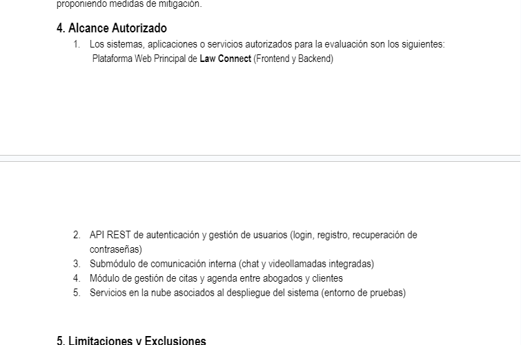
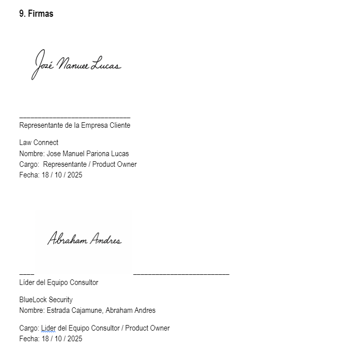
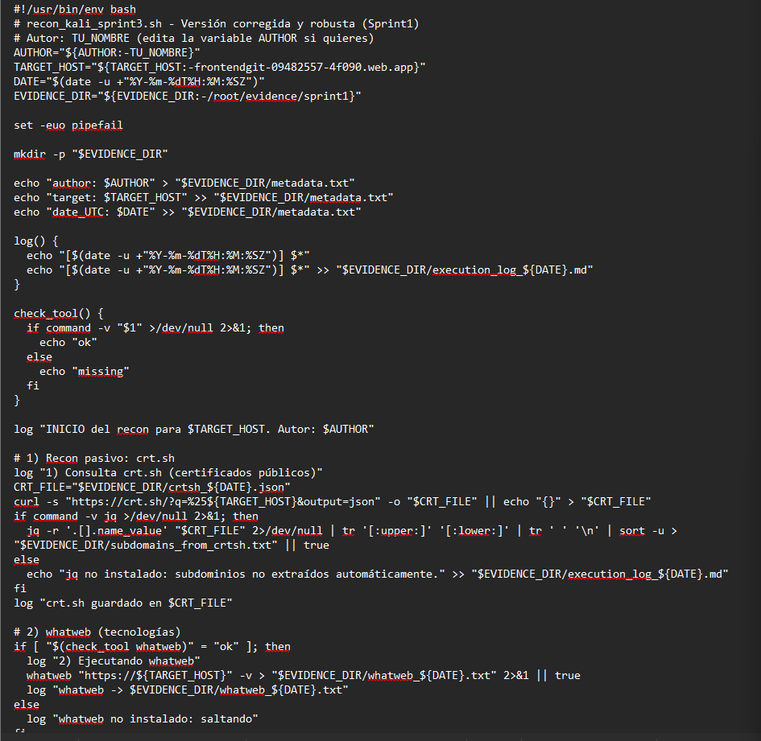
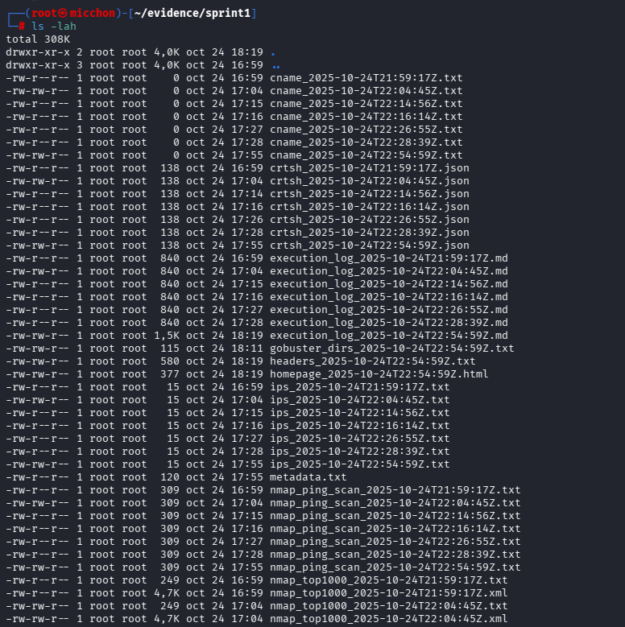
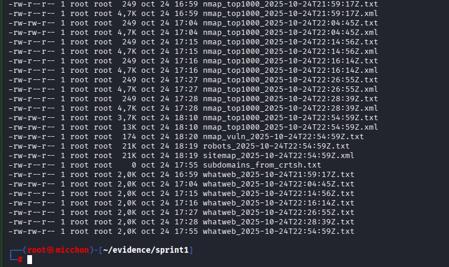

  

<h3 align="center"> Universidad Peruana de Ciencias Aplicadas</h3>
<h3 align="center"> Ingeniería de Software  </h3>
<h3 align="center"> Informe de Trabajo Final – Anti-Hacking y Nuevas Tendencias de Seguridad</h3>
<h3 align="center"> NRC: 14423</h3>
<h3 align="center"> Docente: David Carlos Vera Olivera </h3>
<h3 align="center"> Nombre de la consultora: BlueLock Security</h3>

#### Integrantes
- Chero Eme, Eduardo Andre - u20201f282
- Estrada Cajamune, Abraham Andres - u202112164
- Pariona Lucas, José Manuel - u202119257
- Calle Huayanca, Adrian Alonso - u202011657
- Burga, Anaely - u202118264

<h4 align="center"> Octubre, 2025</h4>

___

# Registro de versiones del informe

| Versión | Fecha      | Autor             | Descripción de modificación                                                                           |
|---------|------------|-------------------|-------------------------------------------------------------------------------------------------------|
| 1.0     | 14/10/25   | Eduardo Chero     | Creación del archivo base en Markdown para el desarrollo del Final Project                            |
| 1.1     | 17/10/25   | Eduardo Chero     | Desarrollo del capitulo 1                           |
| 1.2     | 18/10/25   | Pariona Jose      | Documento Firmado y Aceptación del Servicio de Pentesting                    |

# Project Report Collaboration Insights

# Contenido

1.  [Student Outcome](#student-outcome)
2.  [Capítulo I: Introducción](#capítulo-i-introducción)
    1.  [1.1. Startup Profile (Cliente)](#11-startup-profile-cliente)
        -   [Descripción de la empresa PyME](#descripción-de-la-empresa-pyme)
        -   [Expectativas del cliente](#expectativas-del-cliente)
    2.  [1.2. Consultora de Ciberseguridad (Equipo)](#12-consultora-de-ciberseguridad-equipo)
        -   [Descripción de la consultora](#descripción-de-la-consultora)
        -   [Perfiles de los integrantes y roles Scrum](#perfiles-de-los-integrantes-y-roles-scrum)
    3.  [1.3. Solution Profile](#13-solution-profile)
        -   [Antecedentes y problemática](#antecedentes-y-problemática)
        -   [Objetivos del pentesting](#objetivos-del-pentesting)
    4.  [1.4. Aceptación del Servicio de Pentesting](#14-aceptación-del-servicio-de-pentesting)
3.  [Capítulo II: Metodología Ágil y de Pentesting](#capítulo-ii-metodología-ágil-y-de-pentesting)
    1.  [2.1. Marco de referencia](#21-marco-de-referencia)
    2.  [2.2. Backlog inicial](#22-backlog-inicial)
    3.  [2.3. Planificación de sprints (Sprint Planning)](#23-planificación-de-sprints-sprint-planning)
        -   [Sprint 1: Reconocimiento & Escaneo inicial](#sprint-1-reconocimiento--escaneo-inicial)
        -   [Sprint 2: Enumeración y vulnerabilidades preliminares](#sprint-2-enumeración-y-vulnerabilidades-preliminares)
        -   [Sprint 3: Explotación controlada (web, APIs)](#sprint-3-explotación-controlada-web-apis)
        -   [Sprint 4: Post-explotación y persistencia](#sprint-4-post-explotación-y-persistencia)
        -   [Sprint 5: Informe final y recomendaciones](#sprint-5-informe-final-y-recomendaciones)
    4.  [2.4. Definición de Done (DoD)](#24-definición-de-done-dod)
    5.  [2.5. Herramientas](#25-herramientas)
4.  [Capítulo III: Desarrollo del Proyecto por Sprints](#capítulo-iii-desarrollo-del-proyecto-por-sprints)
    1.  [Sprint 1 – Reconocimiento y Escaneo](#sprint-1--reconocimiento-y-escaneo)
    2.  [Sprint 2 – Enumeración y Vulnerabilidades](#sprint-2--enumeración-y-vulnerabilidades)
    3.  [Sprint 3 – Explotación](#sprint-3--explotación)
    4.  [Sprint 4 – Post-explotación y Persistencia](#sprint-4--post-explotación-y-persistencia)
    5.  [Sprint 5 – Informe Final y Recomendaciones](#sprint-5--informe-final-y-recomendaciones)
5.  [Capítulo IV: Resultados Consolidados](#capítulo-iv-resultados-consolidados)
    1.  [4.1. Matriz de vulnerabilidades](#41-matriz-de-vulnerabilidades)
    2.  [4.2. Evidencias técnicas](#42-evidencias-técnicas)
    3.  [4.3. Impacto en el negocio](#43-impacto-en-el-negocio)
6.  [Capítulo V: Recomendaciones y Plan de Mitigación](#capítulo-v-recomendaciones-y-plan-de-mitigación)
    1.  [5.1. Recomendaciones técnicas](#51-recomendaciones-técnicas)
    2.  [5.2. Recomendaciones organizacionales](#52-recomendaciones-organizacionales)
    3.  [5.3. Priorización por impacto/urgencia](#53-priorización-por-impactourgencia)
7.  [Capítulo VI: Conclusiones y Recomendaciones](#capítulo-vi-conclusiones-y-recomendaciones)
    -   [Conclusiones y recomendaciones del equipo](#conclusiones-y-recomendaciones-del-equipo)
    -   [Lecciones aprendidas en metodología ágil](#lecciones-aprendidas-en-metodología-ágil)
    -   [Relación con Student Outcome 2](#relación-con-student-outcome-2)
    -   [Video “About-the-Team”](#video-about-the-team)
8.  [Bibliografía](#bibliografía)

# Student Outcome
| Criterio específico | Acciones realizadas | Conclusiones |
|---|---|---|
|La capacidad de aplicar el diseño de ingeniería para producir soluciones que satisfagan necesidades específicas con consideración de salud pública, seguridad y bienestar, así como factores globales, culturales, sociales, ambientales y económicos.| **TP1** **PARIONA LUCAS JOSE MANUEL**   Se elaboró el Documento de Aceptación del Servicio de Pentesting, definiendo formalmente el alcance, restricciones y condiciones éticas para garantizar la seguridad y privacidad de los sistemas del cliente.   Se planificó el Sprint 1 (Reconocimiento y Escaneo inicial) aplicando principios de ingeniería segura y metodologías ágiles para estructurar un proceso controlado, reproducible y ético.   Se ejecutaron las actividades de reconocimiento, escaneo y documentación de resultados bajo criterios de mínima intrusión, respeto por los activos del cliente y cumplimiento de buenas prácticas internacionales de ciberseguridad. | **TP1** En la TP1: El proyecto demostró la aplicación efectiva del diseño de ingeniería orientado a la seguridad, permitiendo generar soluciones que protegen la integridad de la información y el bienestar digital del cliente. Las decisiones técnicas se tomaron considerando factores globales, sociales y económicos, promoviendo la cultura de seguridad responsable y el desarrollo sostenible de servicios tecnológicos confiables.|

# Capítulo I: Introducción
## 1.1. Startup Profile (Cliente)
### Descripción de la empresa PyME
Law Connect es un marketplace digital que sirve como nexo entre personas que requieren asesoría legal y abogados profesionales, facilitando un intercambio de servicios. La misión de la empresa es descentralizar el mercado legal en Perú y democratizar el acceso a abogados calificados, basándose en las valoraciones de los propios usuarios.

La plataforma utiliza herramientas tecnológicas como videollamadas, chat en vivo y la posibilidad de agendar reuniones presenciales, permitiéndole tener alcance nacional. Además, Law Connect busca ser una solución al desempleo en el sector legal, conectando abogados con clientes potenciales . Su objetivo principal es asegurar que todos tengan acceso a asesoría legal de calidad.

### Expectativas del cliente
**Confidencialidad e Integridad de Datos:** Asegurar que la información sensible de los clientes y de los abogados esté protegida contra accesos no autorizados.

**Disponibilidad del Servicio:** Garantizar que la plataforma (aplicación web, APIs, móviles)  se mantenga operativa y no sea susceptible a ataques de denegación de servicio.

**Gestión de Identidad:** Verificar la robustez de los módulos de autenticación, registro  y gestión de sesiones.

**Reporte de Vulnerabilidades:** Recibir un informe claro que identifique y priorice las vulnerabilidades encontradas para poder mitigarlas eficientemente

### Descripción de la consultora
BlueLock Security es una consultora de ciberseguridad formada por integrantes del curso enfocados en la investigación, detección y análisis de vulnerabilidades en aplicaciones y servicios de empresas que confian en nosotros para asegurarles que estos no tengan problemas ni generen riesgos de seguridad tanto para estas empresas como para los usuarios.

### Perfiles de los integrantes y roles Scrum
| Integrante | Rol | Código | Carrera | Perfil |
|---|---|---:|---|---|
| Estrada Cajamune, Abraham Andres    | Scrum Master | U202112164  | Ingeniería de Software |Estudiante de ingeniería de software en la Universidad Peruana de Ciencias Aplicadas. Con sólidos conocimientos para el desarrollo Web y Aplicaciones Moviles; tanto frontend como backend.   |
| Pariona Lucas, José Manuel    | Product Owner | U202119257 | Ingeniería de Software | Tengo 20 años. En la actualidad estoy estudiando la carrera de Ingeniería de Software en la Universidad Peruana de Ciencias Aplicadas. Cuento con conocimientos intermedios y avanzados en algunos lenguajes de programación. HTML, CSS, JAVASCRIPT (Avanzado) C++, JAVA, PYTHON (Intermedio) Esto con respecto a la programación, además también de conocimientos con desarrollo web y desarrollo de apps. Me considero una persona responsable, que inspira confianza en el trabajo en grupo. Además, soy bastante adaptativo a la presión y los problemas que pueden llegar a pasar. |
| Chero Eme, Eduardo Andre    | Pentester Lead | U20201F282 | Ingeniería de Software | Estudiante de insgenieria de software con conocimientos en ciberseguridad Experiencia en backend y frontend (Spring Boot, Angular). |
| Calle Huayanca, Adrian Alonso    | Pentester | U20201F282 | Ingeniería de Software |  |
| Burga, Anaely     | Pentester | U20201F282 | Ingeniería de Software | Estudio Ingeniería en la UPC. Cuento con conocimientos intermedios en programación (Python, Java) y en desarrollo web (HTML, CSS, JavaScript) |
## 1.3. Solution Profile
### Antecedentes y problemática
El cliente, Law Connect, opera un marketplace digital que maneja un alto volumen de información personal identificable (PII) y datos confidenciales relacionados con casos legales. La problemática de seguridad radica en que, al ser una plataforma que conecta múltiples usuarios (clientes y abogados) y que busca facilitar la búsqueda de asesoría, expone una superficie de ataque considerable.

Las principales preocupaciones de seguridad incluyen:

**Fuga de Datos:** El riesgo de exposición de datos personales de clientes y abogados, o detalles de casos legales confidenciales.

**Acceso No Autorizado:** La posibilidad de que un atacante suplante la identidad de un usuario o abogado, o escale privilegios dentro de la aplicación.

**Manipulación de Datos:** El riesgo de que se alteren las calificaciones de los abogados o los detalles de los contratos.

**Interrupción del Servicio:** Un ataque exitoso podría dejar la plataforma inoperativa, afectando el negocio principal de la startup.

### Objetivos del pentesting

**Objetivo General:** Evaluar el estado actual de la seguridad de los activos digitales de Law Connect (Aplicación Web, APIs) mediante la ejecución de pruebas de penetración controladas, siguiendo las fases de un hacking ético.

**Objetivos Específicos:**
- Identificar y explotar vulnerabilidades del OWASP Top 10 en la aplicación web.
- Evaluar la seguridad de los endpoints de las APIs utilizadas por la plataforma.
- Realizar escaneos de red y servidores para identificar servicios expuestos y vulnerabilidades conocidas.
- Priorizar los hallazgos utilizando el estándar CVSS.
- Elaborar un informe técnico y ejecutivo que incluya un plan de mitigación detallado. 

## 1.4. Aceptación del Servicio de Pentesting
**Documento de aceptacion del Servicio de Pentesting:**
 
https://docs.google.com/document/d/1y76aXW5gGyK-XvYmcVV_zBNBIXcbHb8tMVlu24L5oU0/edit?usp=sharing
 

<h3 align="center"> Alcance Autorizado</h3>

<h3 align="center"> Firmas</h3>

# Capítulo II: Metodología Ágil y de Pentesting
## 2.1. Marco de referencia
## 2.2. Backlog inicial
## 2.3. Planificación de sprints (Sprint Planning)
### Sprint 1: Reconocimiento & Escaneo inicial
 

**Objetivo del sprint (planificación):**
 
Realizar la recolección de inteligencia (reconocimiento) y el escaneo automático/semiautomático de los activos autorizados para mapear la superficie de ataque de Law Connect y generar artefactos reproducibles que sirvan como base para las siguientes fases (enumeración, explotación y reporte).

**Duración propuesta:** 5 días hábiles (puede ajustarse según disponibilidad del cliente y alcance autorizado).
 
**Alcance del sprint:**
 
Activos autorizados identificados en el documento de aceptación (dominios, subdominios y rangos IP).

Técnicas: reconocimiento pasivo y activo limitado a los activos autorizados.

Herramientas principales: Google Dorking, Sublist3r/amass, crt.sh, Shodan, Nmap, OWASP ZAP (escaneo web), Nessus (escaneo de vulnerabilidades de infraestructura), Burp Suite (apoyo manual), logs y trazas para auditoría.
 
**Historias de usuario incluidas en el sprint (IDs del backlog):**
 
US-02 (Reconocimiento pasivo: subdominios, tecnologías, correos).

US-03 (Descubrimiento hosts vivos con nmap -sn).

US-04 (Escaneo de puertos y versiones nmap -sV -p-).

US-05 (Enumeración de servicios cloud / buckets públicos).

US-06 (Escaneo de vulnerabilidades de infraestructura con Nessus).

US-07 (Escaneo web automatizado con OWASP ZAP).
 
**Criterios de aceptación del sprint:**
 

Lista de activos (dominios, subdominios, IPs/rangos) autorizados y verificados.

Reportes crudos de escaneos (Nmap, Nessus, ZAP) exportados y guardados con metadatos (fecha, autor, comando usado).

Registro de técnicas pasivas y fuentes consultadas (URLs, consultas de Shodan, crt.sh, GitHub searches).

Mapas iniciales del sitio (site map) y lista de endpoints descubiertos.

Checklist DoD cumplido para cada historia (evidencia, reproducibilidad, PoC mínima cuando aplique — sin explotación destructiva).
 
**Distribución de responsabilidades (roles / ownership):**
 
Scrum Master: Abraham (coordinación con cliente para ventanas de prueba y bloqueo de IPs).

Product Owner: José (gestión del alcance autorizado, firma del compromiso).

Pentester Lead: Eduardo (supervisión técnica y revisión de artefactos).

Pentesters: Adrián y Anaely (ejecución de tareas de reconocimiento y escaneo).
### Sprint 2: Enumeración y vulnerabilidades preliminares
### Sprint 3: Explotación controlada (web, APIs)
### Sprint 4: Post-explotación y persistencia
### Sprint 5: Informe final y recomendaciones
## 2.4. Definición de Done (DoD):  
## 2.5. Herramientas: 

# Capítulo III: Desarrollo del Proyecto por Sprints
## Sprint 1 – Reconocimiento y Escaneo
### Objetivos del sprint
Identificar y documentar todos los activos en el alcance autorizado (dominios, subdominios, IPs y rangos).

Realizar reconocimiento pasivo para identificar tecnologías, proveedores y endpoints expuestos sin generar tráfico a producción innecesario.

Ejecutar escaneos activos controlados para detectar hosts vivos, puertos abiertos y versiones de servicios.

Ejecutar escaneos automatizados de vulnerabilidades (infraestructura y web) en modo no destructivo y recoger evidencia cruda.

Generar artefactos y plantillas de evidencia que permitan reproducir resultados en sprints siguientes.
### Historias de usuario atendidas

US-02 — Reconocimiento pasivo: recopilación de subdominios, tecnologías y posibles correos.

US-03 — Descubrimiento de hosts vivos: nmap -sn y técnicas de ping/ICMP/ARP según alcance.

US-04 — Escaneo de puertos y servicios: nmap -sV -p- y scripts NSE relevantes.

US-05 — Enumeración cloud & buckets: búsquedas en Shodan, comprobación de S3/GCP/Azure buckets expuestos (solo lectura, pasivo inicialmente).

US-06 — Escaneo de vulnerabilidades infra: configuración y ejecución de un escaneo en Nessus (o alternativa permitida) en modo no destructivo.

US-07 — Escaneo web automatizado: configuración de OWASP ZAP; crawleo y escaneo activo controlado.
### Actividades realizadas
 
**A. Recolección de datos y reconocimiento pasivo**
 
Fuentes consultadas: crt.sh, whois, GitHub, LinkedIn (perfiles públicos), motores de búsqueda (Google Dorking), Shodan, VirusTotal, censys.

Comandos / acciones ejemplo:

amass enum -d lawconnect.example.com -o evidence/sprint1/subdomains_amass.txt

subfinder -d lawconnect.example.com -o evidence/sprint1/subdomains_subfinder.txt

curl "https://crt.sh/?q=%25lawconnect.example.com&output=json" > evidence/sprint1/crtsh.json

Búsqueda manual/Google Dorks documentadas en evidence/sprint1/google_dorks.md (cada dork con fecha y autor).

Artefactos producidos (plantilla de nombres):

evidence/sprint1/subdomains_{tool}.txt

evidence/sprint1/recon_passive_sources.md (registro con URLs y consultas).
 
**B. Descubrimiento de hosts vivos (escaneo de descubrimiento)**
 
Comando recomendado:

nmap -sn -Pn -oN evidence/sprint1/nmap_ping_scan.txt <rango_o_lista_ips>

Explicación: -sn para ping scan (host discovery), -Pn si se autorizó evitar el ping y forzar conexión TCP.

Guardar salida en texto y XML (para procesamiento):

nmap -sn -oN evidence/sprint1/nmap_ping_scan.txt -oX evidence/sprint1/nmap_ping_scan.xml <rango>.
 
**C. Escaneo de puertos y detección de versiones**
 
Comando recomendado (no agresivo, quedarse dentro de horarios autorizados):

nmap -sV -p- --min-rate 100 -oN evidence/sprint1/nmap_full_tcp.txt <ip>

Para scripts NSE útiles: nmap -sV -p- --script vuln -oN evidence/sprint1/nmap_vuln_scripts.txt <ip>

Exportar resultados legibles y una copia en XML/greppable:

-oG evidence/sprint1/nmap_full_tcp.gnmap y -oX.
 
**D. Escaneo de vulnerabilidades de infraestructura (Nessus / alternativa)**
 
Preparación: cargar targets confirmados por Nmap y ejecutar escaneo con política de solo detección (no explotación).

Exportes requeridos:

evidence/sprint1/nessus_scan_{fecha}.nessus (raw), evidence/sprint1/nessus_summary_{fecha}.pdf (ejecutivo).

Si Nessus no está disponible: usar OpenVAS o nmap --script vuln como respaldo.
 
**E. Escaneo web automatizado (OWASP ZAP)**
 
Configuración:

Iniciar ZAP en modo daemon si se automatiza: zap.sh -daemon -port 8090 -host 127.0.0.1

Usar proxy o modo spider: crawl + active scan con autenticación de prueba si se proporcionaron credenciales de testing.

Exportes:

evidence/sprint1/zap_report_{fecha}.html

evidence/sprint1/zap_passive_findings.json

Observación: para cualquier prueba que interactúe con endpoints sensibles, usar cuentas de prueba y ventanas autorizadas por el cliente.
 
**F. Enumeración cloud / buckets**
 
Comandos / comprobaciones:

aws s3api list-buckets --query "Buckets[].Name" (solo si credenciales y alcance lo permiten; preferible chequeo pasivo por URLs públicas)

Verificación de buckets públicos con aws s3 ls s3://bucket-name --no-sign-request o comprobaciones con s3scanner en modo solo read (sin descarga masiva).

Documentar hallazgos en evidence/sprint1/cloud_enumeration.md (sin incluir datos sensibles si no es permitido).
### Resultados y evidencias
 

**Artefactos entregables del sprint (con nombres sugeridos):**

 
evidence/sprint1/asset_inventory_{fecha}.csv — columnas: tipo (dominio/subdomain/IP), activo, fuente, verificado_por, fecha_verificacion.

evidence/sprint1/subdomains_combined.txt — lista unificada y deduplicada de subdominios.

evidence/sprint1/nmap_ping_scan.txt / .xml / .gnmap — salida cruda del descubrimiento.

evidence/sprint1/nmap_full_tcp.txt / .xml — escaneo de puertos y servicios.

evidence/sprint1/nessus_scan_{fecha}.nessus y evidence/sprint1/nessus_summary_{fecha}.pdf — si se usó Nessus.

evidence/sprint1/zap_report_{fecha}.html — reporte inicial de ZAP (exportado).

evidence/sprint1/recon_passive_sources.md — registro detallado de consultas pasivas (crt.sh, shodan queries, google dorks).

evidence/sprint1/execution_log_{fecha}.md — registro de comandos ejecutados, hora, autor y parámetros (para reproducibilidad).

evidence/sprint1/meeting_signoff_{cliente}_window_{fecha}.pdf — confirmación por parte del cliente del periodo de pruebas (ya debe existir la aceptación del servicio).

docs/sprint1/README_evidences.md — guía para interpretar cada artefacto.

**Formato de cada reporte:** encabezado con: nombre del autor, rol, fecha/hora de ejecución, comando exacto, objetivo, alcance, y advertencias legales (si aplica).
### Retrospectiva del sprint
 

**Qué salió bien**

 
Recolección pasiva permitió construir un inventario inicial amplio sin generar tráfico.

El equipo consolidó un patrón de nombres para evidencias que facilita trazabilidad.

Coordinación clara con Product Owner para confirmar IPs/dominios autorizados.
 
**Qué no salió tan bien / bloqueadores**
 
Ventanas de prueba reducidas por la disponibilidad del cliente (sugiere negociar ventanas más largas para próximos sprints).

En algunos hosts, escaneos frontales fueron parcialmente bloqueados por WAFs — requiere plan de trabajo con cliente para pruebas autenticadas o whitelisting de IPs.

Falta de algún acceso a consola/credenciales de testing (si se esperaba) impidió un crawling más profundo autenticado.
 
**Acciones concretas (propietario y fecha objetivo)**
 
Solicitar whitelisting de la IP de pruebas para los próximos escaneos (Propietario: José — PO). Fecha objetivo: +2 días.

Automatizar el pipeline de evidencia (script que sube y normaliza nombres) para evitar errores humanos (Propietario: Eduardo — Pentester Lead). Fecha objetivo: +7 días.

Definir procedimiento ante WAF: cuando se detecte bloqueo, registrar captura y escalonar al cliente para habilitar pruebas (Propietario: Abraham — Scrum Master). Fecha objetivo: inmediata.

Completar checklist DoD para cada historia, firmada digitalmente por el responsable técnico antes de cerrar el sprint.
 
**Mejoras técnicas para el siguiente sprint**
 
Incluir uso de Burp Suite para enumeración autenticada más profunda.

Añadir fuzzing ligero de endpoints API listados (con límites de tasa) en Sprint 2.

Establecer plantilla PoC mínima (captura de request/response, timestamp, instrucción para reproducir).
 
**Notas finales y plantilla para anexar al informe final del sprint**
 
Registro de actividades: cada acción debe tener un registro en evidence/sprint1/execution_log_{fecha}.md con: comando, propósito, autor, duración, resultado (éxito/fallo), notas.

Confidencialidad: ninguna evidencia que contenga PII o datos sensibles debe subirarse al repositorio público; usar carpeta encriptada / repositorio privado o incluir solo metadatos y capturas redactadas.

Entrega intermedia al cliente: entregar un Executive Summary (PDF) que contenga: alcance del sprint, actividades realizadas, nivel de cobertura (hosts escaneados / totales), riesgos observados a alto nivel (sin detalles explotables), y next steps. Archivo sugerido: reports/sprint1/executive_summary_sprint1_{fecha}.pdf.

Archivo Bash con comandos utilzados para el 100% de este sprint 1:

 

Link donde se encuentra el Archivo sh. 
 
https://github.com/BlueLockSecurity/Recursos/blob/main/sprint1/recon_kali_sprint3.sh

Evidencias de resultados obtenidos en KALI LINUX:
 

 

Y link de archivos de este primer sprint con sus resultados: 
 
https://github.com/BlueLockSecurity/Recursos/tree/main/sprint1
 

## Sprint 2 – Enumeración y Vulnerabilidades
### Historias de usuario atendidas
### Actividades
### Resultados y evidencias
### Retrospectiva
## Sprint 3 – Explotación
### Historias de usuario atendidas
### Actividades
### Resultados y PoC
### Retrospectiva
## Sprint 4 – Post-explotación y Persistencia
### Historias de usuario atendidas
### Actividades
### Evidencias
### Retrospectiva
## Sprint 5 – Informe Final y Recomendaciones
### Historias de usuario atendidas
### Consolidación de hallazgos y plan de mitigación
### Preparación de la presentación ejecutiva
### Retrospectiva global

# Capítulo IV: Resultados Consolidados
## 4.1. Matriz de vulnerabilidades
## 4.2. Evidencias técnicas
## 4.3. Impacto en el negocio

# Capítulo V: Recomendaciones y Plan de Mitigación
## 5.1. Recomendaciones técnicas 
## 5.2. Recomendaciones organizacionales 
## 5.3. Priorización por impacto/urgencia

# Capítulo VI: Conclusiones y Recomendaciones
## Conclusiones y recomendaciones del equipo
## Lecciones aprendidas en metodología ágil
## Relación con Student Outcome 2
## Video “About-the-Team”

# Bibliografía
